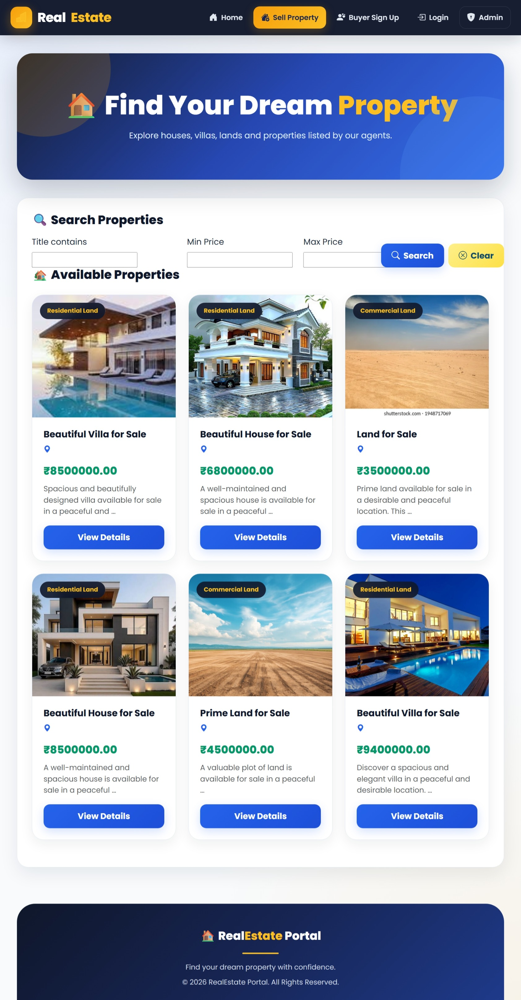
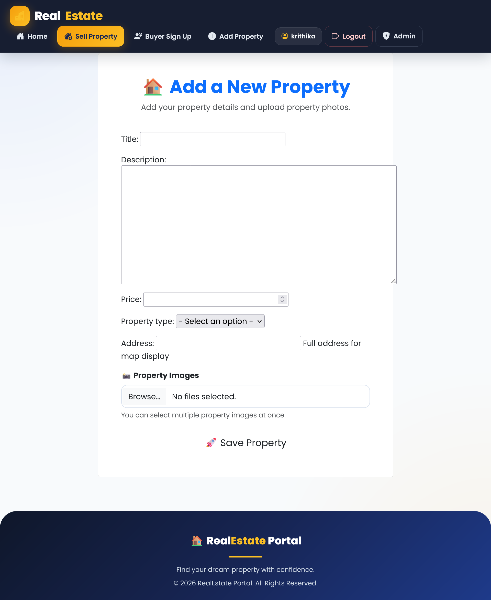
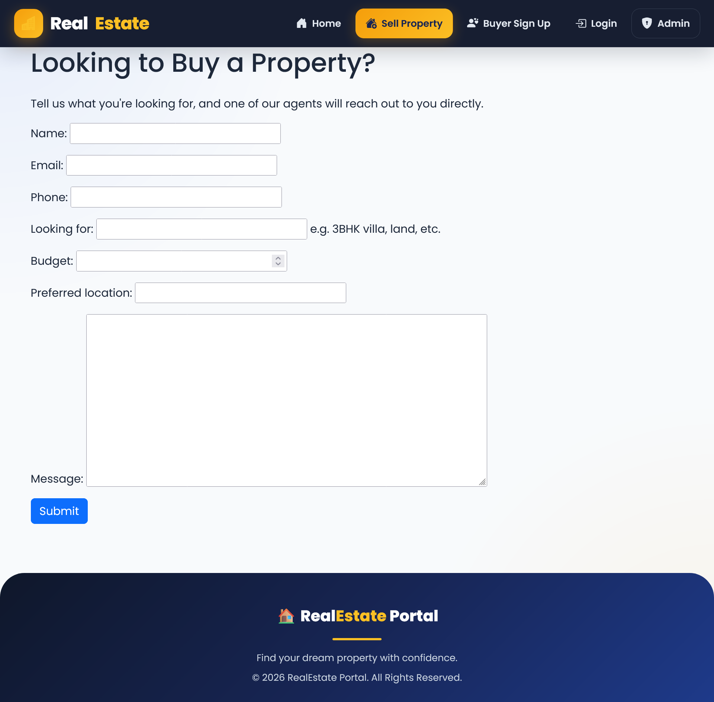
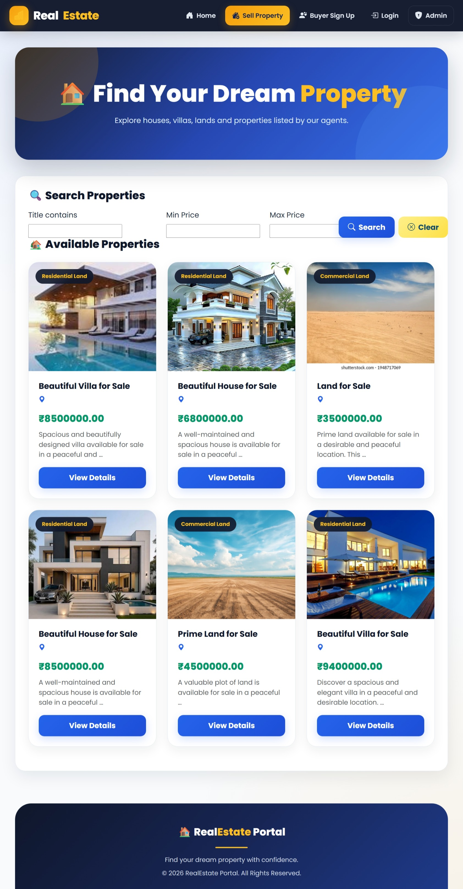
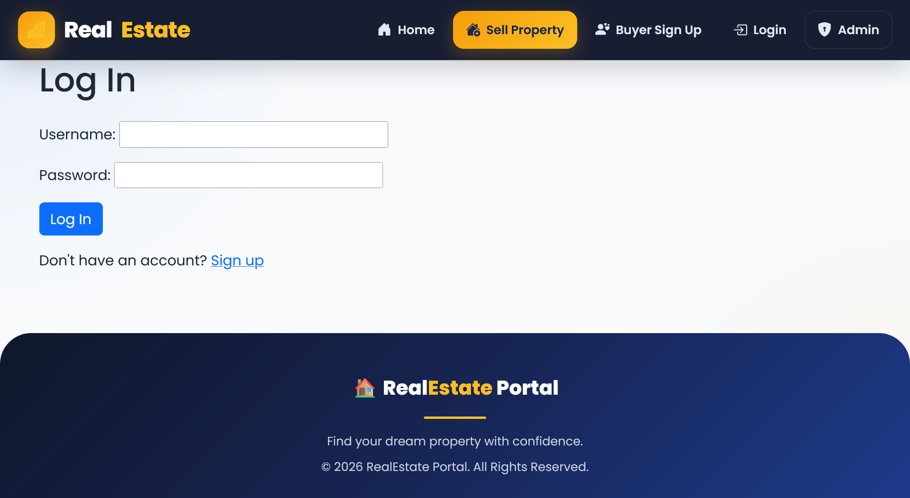
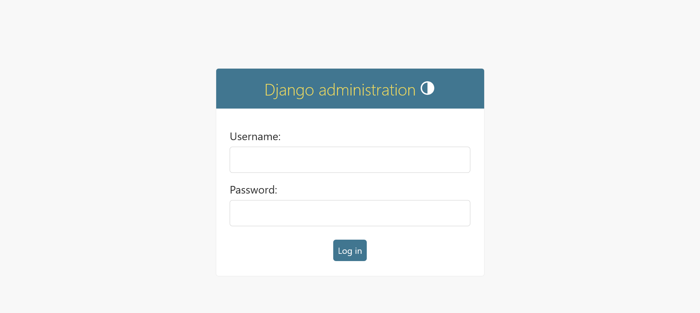

# 🏠 RealEstate Portal

A full-stack real estate property listing platform built with Django, MySQL, and Bootstrap. Agents list properties with images and location maps, while buyers and sellers connect with agents directly.

🔗 **GitHub:** https://github.com/Keerthi-3009/real-estate-project

## Features

- Property listings with search and price filters
- Multiple image uploads per property
- Google Maps integration on property detail pages
- Agent authentication (sign up, log in, manage own listings)
- Buyer Sign Up for general property requirements
- Sell Your Property form for sellers (with image upload)
- Contact Agent inquiry form on each listing
- Success messages on form submissions
- Role-based access — only agents can add/edit/delete listings
- Full Django admin dashboard

## Tech Stack

- **Backend:** Python, Django
- **Database:** MySQL
- **Frontend:** HTML, Bootstrap 5, Custom CSS, Bootstrap Icons
- **Image Handling:** Pillow
- **Filtering:** django-filter

## Screenshots

### Homepage


### Add Property Form


### Buyer Sign Up


### Sell Your Property


### Login Page


### Django Admin


## Setup Instructions

1. Clone the repository
```bash
git clone https://github.com/Keerthi-3009/real-estate-project.git
cd real-estate-project
```

2. Create and activate a virtual environment
```bash
python -m venv venv
venv\Scripts\activate
```

3. Install dependencies
```bash
pip install django mysqlclient pillow django-filter
```

4. Set up the MySQL database
```sql
CREATE DATABASE real_estate_db CHARACTER SET utf8mb4;
```

5. Run migrations
```bash
python manage.py makemigrations
python manage.py migrate
```

6. Create a superuser
```bash
python manage.py createsuperuser
```

7. Run the server
```bash
python manage.py runserver
```

Visit `http://127.0.0.1:8000/` for the site, `http://127.0.0.1:8000/admin/` for the admin dashboard.